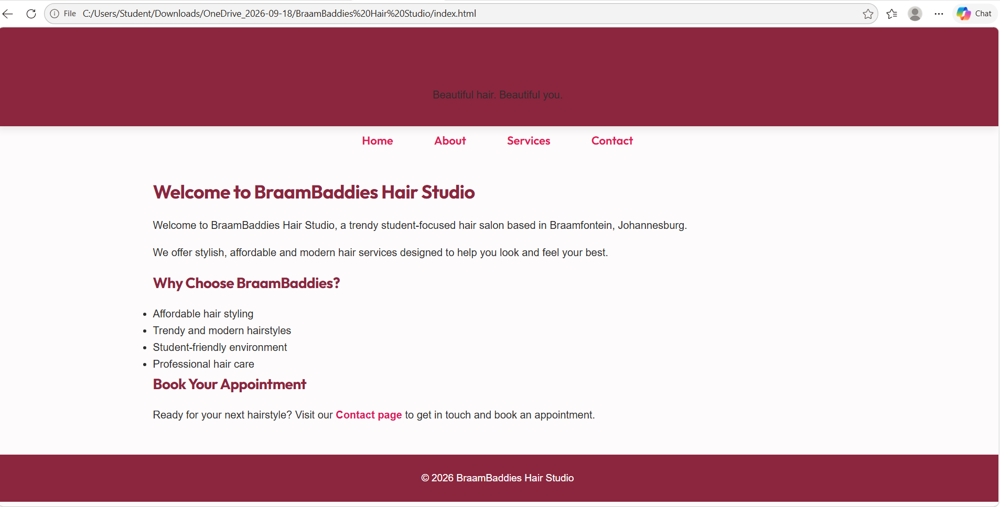
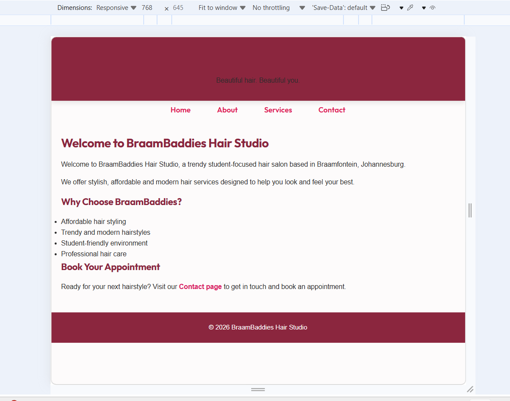
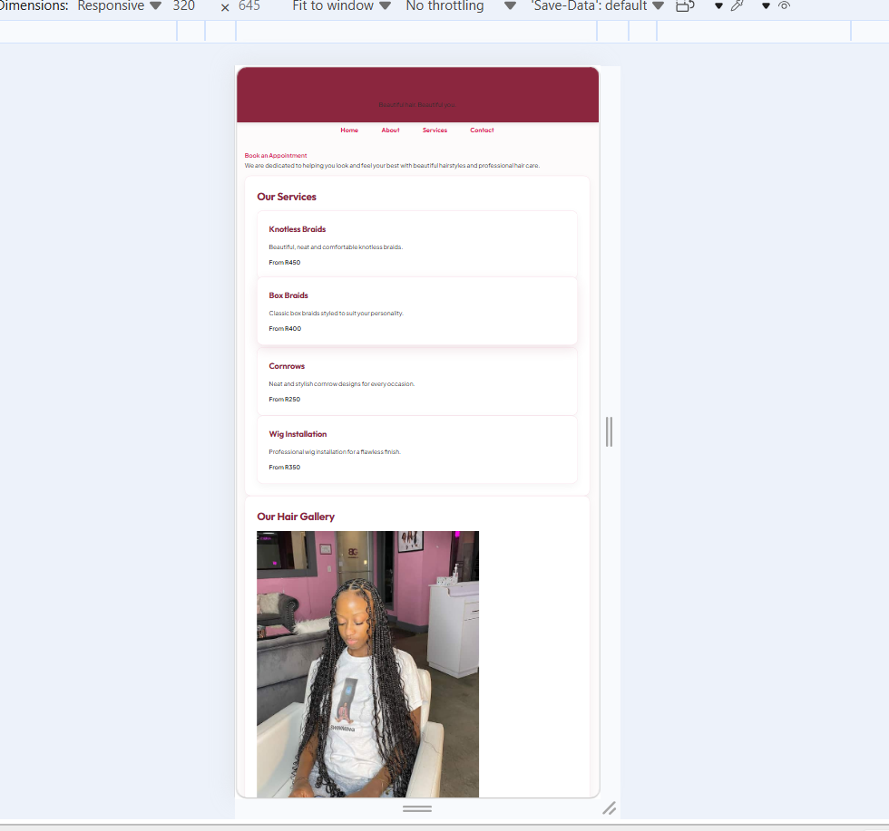

# WEDE5020 Portfolio of Evidence - Part 1

**Student Name:** Precious Bobbejan  
**Student Number:** ST10531306 
**Module:** Web Development 1 (WEDE5020)  
**Organisation:** BraamBaddies Hair Studio  

---

## Project Overview
This repository contains the HTML5 source code and custom CSS3 styling, responsive layouts, and visual documentation for the BraamBaddies Hair Studio website project.

## File Hierarchy
- `index.html` - Homepage
- `about.html` - About Us
- `services.html` - Services & Pricing
- `contact.html` - Contact Us
- `css/style.css` - Custom Stylesheet
- `images/` - Visual assets and responsive screenshots

## Part 2 implementation Details
-**External CSS:** Styling is isolated in 'css/style.css' and linked across all pages.
-**Typography & Units:** Styling uses  relative units ('rem', '%') to support clean font scaling and proportional spacing.
**Layout Structure:** Flexbox and CSS Grid organize multi-column components on larger viewpoints.
**Responsive Media Queries:** Breakdown points ('768px' for tablets and '480px' for mob ile devices) stack content into readable single-column layouts.

## Changelog
- **2026-08-13**: Created core page structures, navigational hierarchy, form layouts, and responsive CSS styling.
- **2026-09-17**: Standardized navigation bar links across all the HTML files: removed reduntant "Book now" link on 'about.html'.
- **2026-09-17:** Connected CTA text links on Home and "Book an Appointment" buttons directly to 'contact.html'.
- **2026-09-17**: Applied CSS media queries ('768px' and '480px') and replaced fixed pixel values with relatives units ('rem').
- **2026-09-17:** Added screenshot evidence for Desktop, Tablets, and Mobile views into 'README.md'.

## Responsive Design Evidence

### Desktop View 

### Tablet View

### Mobile View 

## References
- FontAwesome (2026) *Free Web Icons*. Available at: https://fontawesome.com/
- Google Fonts (2026) *Aptos and Standard Web Typography*. Available at: https://fonts.google.com/
- Unsplash (2026) *Royalty-Free Stock Photography*. Available at: https://unsplash.com/
- W3Schools (2026) *CSS Responsive Web Desing*. Available at: https://www.w3schools.com/css/css_rwd_intro.asp